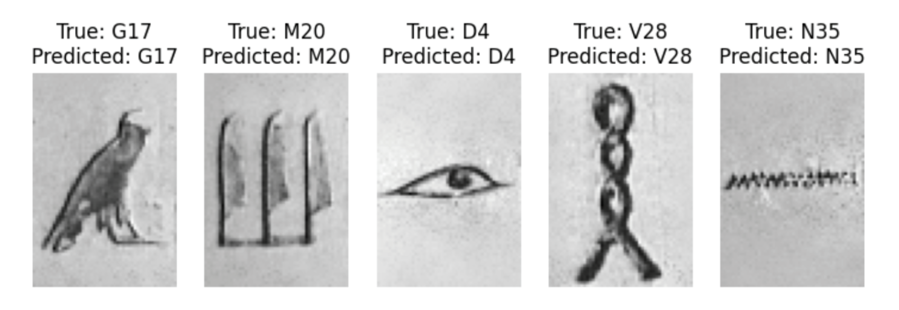

# hieroglyph-cnn
Classification of frequent Egyptian hieroglyphs with deep learning. See the poster for a more detailed report.

Dataset can be downloaded from: http://iamai.nl/downloads/GlyphDataset.zip

Examples hieroglyphs from the dataset:

 

Example predictions:

 
